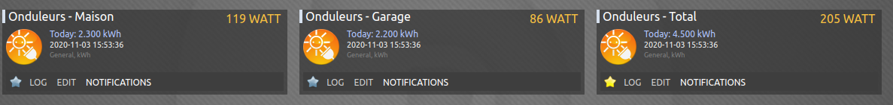

# solax_inverter
**Plugin python Domoticz pour les onduleurs Solax**

Ce plugin permet de rapatrier les données de productions des onduleurs Solax depuis le cloud.
Pour pouvoir utiliser ce plugin, vous devez auparavant vous connecter avec votre compte sur https://www.solaxcloud.com et faire la demande d'un TokenID depuis le menu "Un Service"

Dans le plugin, il suffira ensuite de saisir:
  - le TokenID 
  - le/les numéro(s) d'enregistrement(s) des modules wifi (et non pas le numéro de série des onduleurs)
  - adresse IP de Domoticz
  - Numéro du port de Domoticz

Une fois les appareils créés, éditez les et vérifiez:
  - Type : Return
  - Energy read: From Device

**Domoticz python plugin for Solax inverters**

This plugin allow to use Solax API to connect and retrieve inverter data production from cloud.

To be able to use this plugin, you have to connect first to https://www.solaxcloud.com with your account and ask a TokenID in "Services" menu

In the plugin, enter:
  - the TokenID,
  - the registration number(s) (the wifi module, not the inverter S/N)
  - Domoticz IP Address
  - Domoticz Port number

Once devices created, edit and check its:
  - Type : Return
  - Energy read: From Device
